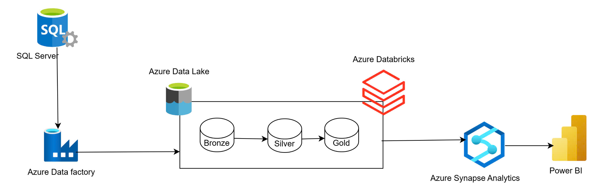

# Azure-Realtime-Data-Streaming

Dự án này nhằm xây dựng một quy trình ETL toàn diện trên Azure. Mục tiêu là Extract dữ liệu khách hàng và doanh số từ cơ sở dữ liệu SQL Server, Transform dữ liệu thông qua Azure Databricks , và load dữ liệu đã transform vào Azure Synapse Analytics phuc vụ cho việc tạo dashboard Power BI.

# Các bước thực hiện

## Bước 1: Thiết lập Môi trường Azure
- Tạo Resource Group: Thiết lập một resource group mới trên Azure.
- Tạo một Azure Data Factory instance.
- Thiết lập Azure Data Lake Storage với các container bronze, silver, và gold.
- Thiết lập một Azure Databricks workspace và một Synapse Analytics workspace.
- Cấu hình Azure Key Vault để quản lý secrets.

## Bước 2: Extract Data 
- Tạo các pipelines trong Azure Data Factory để load dữ liệu từ SQL Server vào lớp bronze trong Azure Data Lake Storage (ADLS).

## Bước 3: Data Transformation
- Transform Data: Sử dụng các Databricks notebooks để làm sạch và tổng hợp dữ liệu, chuyển dữ liệu từ bronze sang silver và sau đó sang gold.

## Bước 4: Data Loading and Reporting
- Load Data into Synapse: Thiết lập một Synapse SQL pool và load dữ liệu từ gold để phân tích.
- Create Power BI Dashboard: Kết nối Power BI với Synapse và tạo dashboard.

## Bước 5: Automation and Monitoring
- Schedule Pipelines: Sử dụng trigger trong Azure Data Factory để lên lịch cho các data pipelines chạy hàng ngày.

# Dashboard

